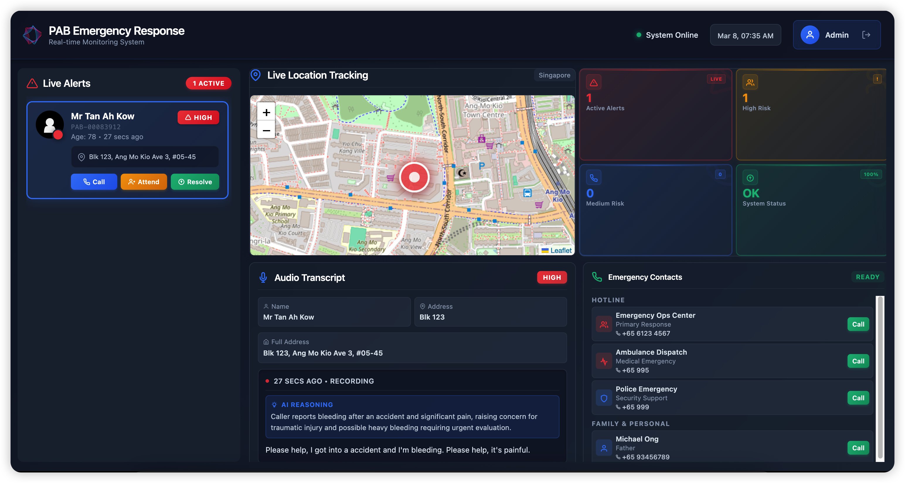
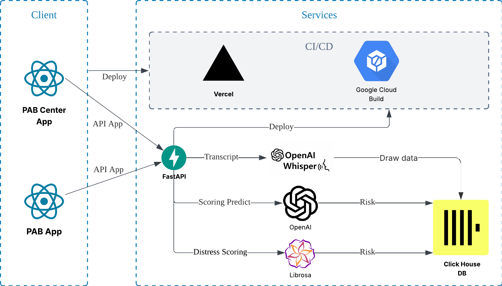

# Hackomania-2026

Hackomania 2026 HackIT Team 24h Hackathon project: Emergency Response System with PAB Dashboard, User Audio Recorder.

- Chuong:  chuongpqvn@gmail.com 
- Tuan Le: leducanhtuan3006@gmail.com 
- Samuel: SamLee347@hotmail.com 
- Yan: chooyanprogramming@gmail.com

Live Demo :

- PAB Dashboard: https://hackomania-2026.vercel.app/
- User Audio: https://hackomania-2026.vercel.app/user.html

Presentation: 
- [PowerPoint Slides](https://docs.google.com/presentation/d/1t6mOE3n6bdeLQVjkHmwJMtGJtA2nQcDHQ6C2UskmWic/edit?usp=sharing)
- [Lucidchart Diagram](https://lucid.app/lucidchart/1366c763-caef-450c-9534-fe6c66a39e98/edit?view_items=IokUlqxaL2PuV1AHdFKDwjptYKA%3D&page=0_0&invitationId=inv_f80f99aa-ecd0-4dfb-a001-e668f696a970)

## 📋 Project Overview

This project consists of a comprehensive emergency response system with:
- **PAB Dashboard**: Real-time monitoring dashboard for emergency alerts
- **User Audio Recorder**: Voice recording interface for emergency reports
- **Backend API**: Python FastAPI backend for data management



## Sytem Architecture



## 🚀 Quick Start - Deployment

Deploy both frontends to a single domain:

```bash
# Quick deploy to Vercel
vercel --prod
```

**Access URLs after deployment:**
- Main Dashboard: `https://yourdomain.com`
- User Audio: `https://yourdomain.com/user.html`

📖 **Detailed deployment guide**: See [DEPLOY_QUICK.md](DEPLOY_QUICK.md) or [DEPLOYMENT.md](DEPLOYMENT.md)

## 🛠️ Local Development

### Frontend - PAB Dashboard
```bash
cd front-end/pab-dashboard
npm install
npm run dev
```

### Frontend - User Audio
```bash
cd front-end/user-audio
npm install
npm start
```

### Backend
```bash
cd backend
source .venv/bin/activate  # or: .venv\Scripts\activate on Windows
pip install -r requirements.txt
uvicorn app.main:app --reload
```

## 📁 Project Structure

```
├── backend/              # FastAPI backend
├── front-end/
│   ├── pab-dashboard/   # Main dashboard (Vite + React)
│   └── user-audio/      # Audio recorder (Create React App)
├── docs/                # Documentation
├── deploy.sh            # Combined build script
├── vercel.json          # Deployment configuration
└── DEPLOYMENT.md        # Detailed deployment guide
```

## 🌐 Deployment

The project uses a unified deployment strategy where both frontends are combined:
1. PAB Dashboard serves at the root (`/`)
2. User Audio serves at `/user.html`

Run `./deploy.sh` to build both apps into a single `dist-combined/` directory.

## 📝 License

See [LICENSE](LICENSE) for details.

## Many Thanks

- https://hackomania.geekshacking.com/
- All our teammates for their hard work and creativity!
- The Hackomania organizers for hosting this amazing event!
- Our friends and family for their support and encouragement!
- And of course, the users who will benefit from our system in real emergencies! 🙌
- Many thanks for all responses and feedback from the judges and mentors! We really appreciate it and will use it to improve our project further! 😊